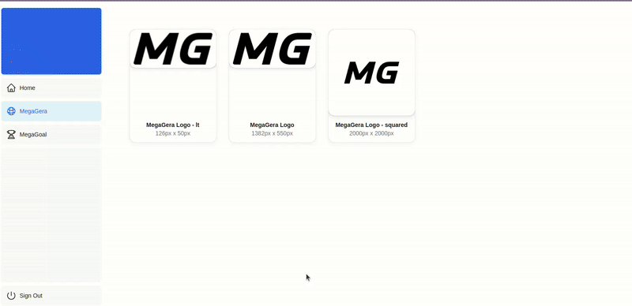

# MegaMedia

**MegaMedia** is a service within [**Mega microservices architecture**](https://github.com/MegaGera/Mega).

*MegaMedia* serves static files to other *Mega* services and offers a UI web application to handle these files.

## Table of Contents

- [Service Description](#service-description)
  - [Features](#features)
- [Part of Mega](#part-of-mega)
- [Architecture](#architecture)
- [Setup and Installation](#setup-and-installation)
- [License](#license)
- [Contact & Collaborate](#contact--collaborate)

## Service Description

*MegaMedia* provides static files, such as images, to the others services like *MegaGoal* with the images of the football leagues and teams. With the web application you can access to all the images and updates them. The idea is for each  *Mega* service there would be different types of features to handle these static files, but reuse the modules as much as possible.

For the static files of *MegaGoal*, it needs to use to the *MegaGoal Server* to get the metadata of the leagues and the teams for correlate the static images with the entities.

The service is deployed in production.

Web Application: [https://megamedia.megagera.com](https://megamedia.megagera.com/)

### Features

- Serve Static Files
- Update Static Files
- See Previous Files
- Delete Previous Files
- Squared Previous Files

## Part of Mega

*MegaMedia* is part of the larger [**Mega**](https://github.com/MegaGera/Mega) project, a collection of web applications built with a **microservices architecture**.

[**Mega**](https://github.com/MegaGera/Mega) includes other services such as a [Proxy (*MegaProxy*)](https://github.com/MegaGera/MegaProxy), [Authentication (*MegaAuth*)](https://github.com/MegaGera/MegaAuth), and other Web Applications ([*MegaGoal*](https://github.com/MegaGera/MegaMedia), [*MegaHome*](https://github.com/MegaGera/MegaHome), [*MegaDocu*](https://docusaurus.io/))

## Architecture

There are **three services in this application**. They are all used by *MegaMedia* as a 'parent' service, but also individually by other services in *Mega*.

- **WebApp**: Web application built with [Next.js](https://nextjs.org/) (React). With the application you can navigate through the static files of the different services. It is deployed by a Docker container. More information and source code under the [`WebApp`](WebApp) folder.
- **Server**: API Server built with [`Go`](https://go.dev/) to interact with the entities used in the WebApp client. It also uses *MegaGoal* to load the data of the football teams. It is deployed by a Docker container. More information and source code under the [`Server`](Server) folder.
- **Database**: [`MongoDB`](https://www.mongodb.com/es) Database that stores document information of the static files, like the metadata of the images. It is deployed by a Docker container in a docker-compose file.

All these services are deployed by [**Docker containers**](https://www.docker.com/) in a [**AWS EC2 machine**](https://aws.amazon.com/es/ec2/).

## Setup and Installation

The information to run [`WebApp`](WebApp), [`Server`](Server) applications is under their folders of this repository. All of them are deployed with Docker and you can find the proccess of build and deploy in the `Dockerfile` and `docker-compose.yml` files of each folder.

## License

This project is licensed under the MIT License. See the LICENSE file for details.

## Contact & Collaborate

Contact with me to collaborate :)

- gera1397@gmail.com
- GitHub: [MegaGera](https://github.com/MegaGera)